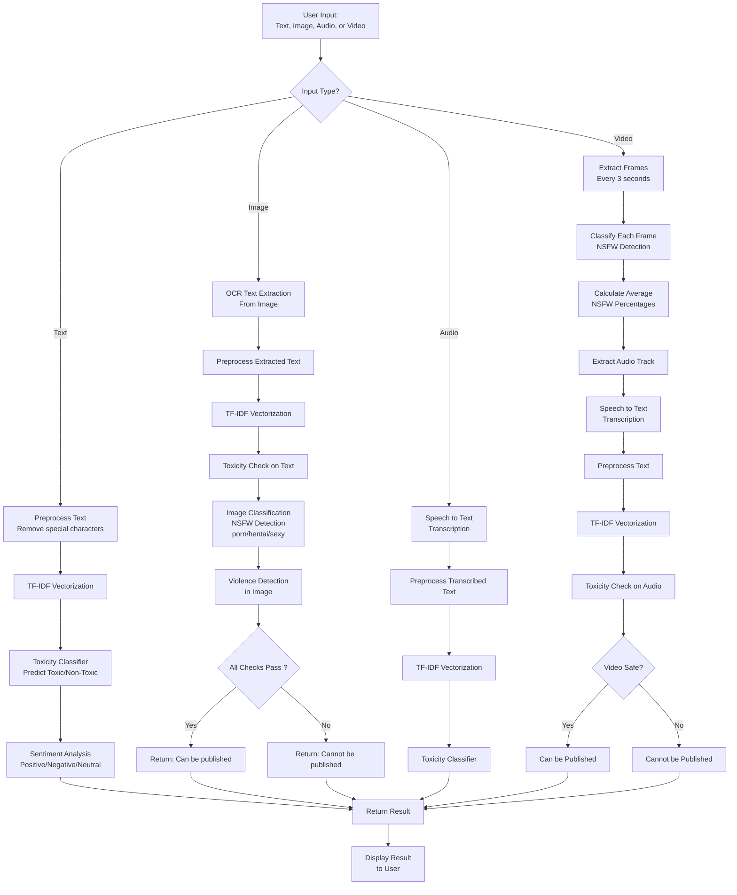

<p align="center">
  
</p>

<h1 align=center>AI Content Moderation Analysis (ACMA)<h1/>

## Overview

ACMA (AI Content Moderation Analysis) is an advanced AI-driven content moderation system designed to detect and analyze toxicity, inappropriate visuals, violence, and other harmful content in various media types including text, images, audio, and video. This system helps maintain safe online environments by enforcing community guidelines, legal compliance, and ethical standards while respecting user privacy and freedom of expression.

This project was developed as a final year project to demonstrate the application of machine learning and computer vision techniques in content moderation.

## Features

### Multi-Modal Content Analysis
- **Text Moderation**: Detects toxic language and analyzes sentiment using NLP techniques
- **Image Moderation**: Extracts text from images using OCR and classifies visual content for inappropriate material (porn, hentai, sexy content) and violence detection
- **Audio Moderation**: Transcribes speech to text and analyzes for toxicity
- **Video Moderation**: Processes video frames to detect nudity, violence, and toxic content in audio tracks

### Key Capabilities
- Toxicity detection using machine learning classifiers
- Image classification for NSFW content using deep learning models
- Violence detection in images and videos
- OCR (Optical Character Recognition) for text extraction from images
- Speech-to-text conversion for audio analysis
- Sentiment analysis for text content
- Real-time content analysis through web interface

## Technologies Used

- **Backend**: Python Flask
- **Machine Learning**: TensorFlow, Keras, scikit-learn
- **Computer Vision**: OpenCV, EasyOCR
- **Natural Language Processing**: NLTK
- **Audio Processing**: SpeechRecognition, MoviePy
- **Frontend**: HTML, CSS (Tailwind CSS), JavaScript
- **Data Processing**: NumPy, Joblib

## Project Workflow Diagram


## Project Structure

```
├── app.py                          # Main Flask application
├── toxicity_classifier.pkl         # Trained toxicity detection model
├── tfidf_vectorizer.pkl            # TF-IDF vectorizer for text processing
├── IMG_MODEL.299x299.h5            # Image & Video classification model
├── VIOLENCE_DETECTION.h5           # Violence detection model
├── template/                       # HTML templates
│   ├── index.html                  # Home page
│   ├── predict.html                # Content analysis interface
│   └── aboutus.html                # About page
├── static/                         # Static assets
│   ├── img/                        # Images and icons
│   ├── scripts/                    # JavaScript files
│   └── styles/                     # CSS stylesheets
└── uploads/                        # Directory for uploaded files
```

## How It Works

### Text Analysis
1. Input text is preprocessed (removing special characters)
2. Features are extracted using TF-IDF vectorization
3. Toxicity classifier predicts if content is toxic
4. Sentiment analysis determines positive/negative/neutral sentiment

### Image Analysis
1. OCR extracts any text from the image
2. Extracted text is analyzed for toxicity
3. Image is classified using deep learning model for inappropriate content
4. Violence detection model checks for violent content
5. Content is flagged as "Cannot be published" if any checks fail

### Audio Analysis
1. Speech recognition converts audio to text
2. Transcribed text is analyzed for toxicity using the same text pipeline

### Video Analysis
1. Video frames are extracted at regular intervals
2. Each frame is analyzed for nudity/inappropriate content
3. Audio track is extracted and analyzed for toxicity
4. Video is flagged if any frame or audio contains prohibited content

## Installation and Setup

### Prerequisites
- Python 3.7+
- pip package manager

### System Requirements
- **Hardware**: Windows 10 or higher, 8 GB RAM at least, CPU of 2 GHz or higher frequency, GPU is recommended for fast performance, HDD/SSD 500 GB.
- **Software**: Python version 3.11.5 (recommended) or higher and TensorFlow version 2.12.0 (recommended).
- **Libraries**: flask, tensorflow, keras, easyocr, opencv, re, speech_recognition, joblib, numpy, nltk, moviepy.
- **IDE**: VS Code or Python IDE for running the project.

### Dependencies
Install the required packages using the provided requirements.txt file:

```bash
pip install -r requirements.txt
```

### NLTK Data
Download required NLTK data:

```python
import nltk
nltk.download('vader_lexicon')
```

### Model Files
Ensure all model files are present in the root directory:
- `toxicity_classifier.pkl`
- `tfidf_vectorizer.pkl`
- `IMG_MODEL.299x299.h5`
- `VIOLENCE_DETECTION.h5`

## Usage

### Running the Application
1. Open the project folder (ACMA).
2. Right-click and open VS Code.
3. Run the Flask application in terminal:
```bash
python app.py
```
4. 'Ctrl + Click' & 'Follow the link':
`http://localhost:5000`
5. You will be directed to the ACMA front end where you can analyze the content.

### Using the Web Interface
1. **Home Page**: Overview of the system and its features
2. **Classify Page**: Upload content for analysis
   - Enter text directly or upload files (images, audio, video)
   - Click "Test" to analyze the content
   - View results showing detected text and toxicity status

### API Usage
The system provides a REST API endpoint:

**POST** `/detect_toxicity`

Parameters:
- `text` (optional): Text content to analyze
- `file` (optional): File upload (image, audio, or video)

Response format:
```json
{
  "text": "extracted or input text",
  "toxicity_result": "Toxic/Non-Toxic/Cannot be published"
}
```

## Vision and Goals

The vision of ACMA is to create safer online communities by:
- Maintaining user safety and well-being
- Enforcing community guidelines
- Ensuring legal compliance
- Protecting privacy and ethical standards
- Leveraging AI and machine learning for efficient moderation
- Balancing content control with freedom of expression

## Content Disclaimer

This project may contain explicit language, adult themes, or sensitive material, including audio, video, images, and text. Such content is included solely for testing purposes within the project.

## Contact Information

**Developers**: Aditya Singh, Harshit Saxena, Ayush Sharma, Ayush Vishnoi <br/>
**College**: MIT Moradabad, India

## License

© 2023-Present ACMA - All rights reserved.

---

*This project demonstrates the integration of multiple AI technologies for comprehensive content moderation. For educational and research purposes.*
